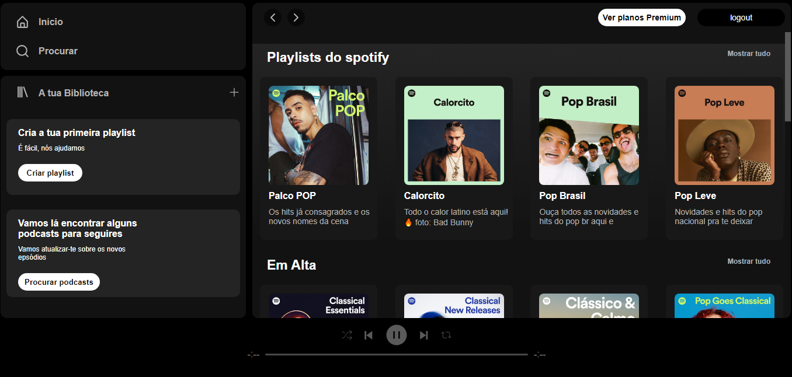

<h1>Spotify-clone</h1>

## 📚 Seção

- **Home:** Listagem de músicas com 4 categorias de músicas, ao clicar no link de cada categoria , você consegue ver a listagem completa;
- **Em desenvolvimento:** parte de busca , para retornar as músicas ou artistas solicitados.

<a href="https://spotify-clone-rfha.vercel.app/" target="__blank">Clique aqui para ver o projeto</a>

<a href="https://developer.spotify.com/documentation/web-api" target="__blank">
Documentação da api do spotify</a>

💻<h1>Tecnologias</h1>
<ul>
<li>React</li>
<li>Lucide-react</li>
<li>React-icons</li>
<li>Api do spotify</li>
<li>Css</li>
<ul>
