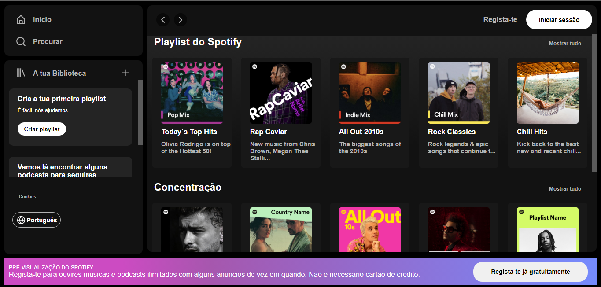

<h1>Spotify-clone</h1>

<a href="https://spotify-clone-one-beige.vercel.app/" target="__blank">Clique aqui para ver o projeto</a>

💻<h1>Tecnologias</h1>
<ul>
<li>React</li>
<li>Lucide-react</li>
<li>React-icons</li>
<li>Css</li>
<ul>
